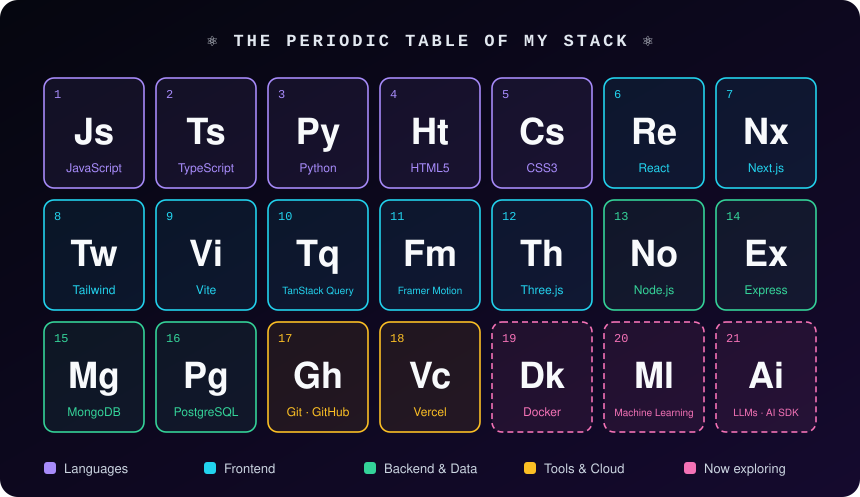

<div align="center">



<a href="https://github.com/joshuablac">
  
</a>

</div>

### `> whoami`

```js
const joshua = {
  role:      "Digital Craftsman · Software Developer",
  mission:   "Bring the impossible to life with code, creating solutions and opportunities for people around me",
  stack:     ["JavaScript", "TypeScript", "React", "Next.js", "Node.js", "Express", "MongoDB"],
  exploring: ["Machine Learning", "AI agents", "Cybersecurity"],
  motto:     "GOD FIRST IN ALL I DO",
};
```

<div align="center">
  
</div>

## ⚛ Open Source Contributions

| Project | Contribution | Status |
|---|---|---|
| [Mongoose](https://github.com/Automattic/mongoose) (27k★) | [Fixed a broken link to the Mongoose API in the async/await docs](https://github.com/Automattic/mongoose/pull/16517). | ✅ Merged |
| [highlight.js](https://github.com/highlightjs/highlight.js) (25k★) | [Fixed a ReDoS (freeze) vulnerability in the LiveScript grammar](https://github.com/highlightjs/highlight.js/pull/4546). A 40k-character input went from 11.6 s to 47 ms to highlight. | 🟡 Open |
| [swagger-ui](https://github.com/swagger-api/swagger-ui) (29k★) | [Show property-level `title` in OpenAPI 3.1 schemas](https://github.com/swagger-api/swagger-ui/pull/11062). It was being silently dropped. | 🟡 Open |

## 📡 Activity

<div align="center">
  
  <br/><br/>
  <picture>
    <source media="(prefers-color-scheme: dark)" srcset="https://raw.githubusercontent.com/joshuablac/joshuablac/output/github-snake-dark.svg" />
    <source media="(prefers-color-scheme: light)" srcset="https://raw.githubusercontent.com/joshuablac/joshuablac/output/github-snake.svg" />
    
  </picture>
</div>

## 🛰 Connect

<div align="center">

<a href="https://joshua-portfolio-six.vercel.app/"></a>
<a href="https://www.linkedin.com/in/joshua-adebusola-67abb3319/"></a>
<a href="https://x.com/AdebusolaJoshua"></a>
<a href="mailto:joshuaoluadebusola@gmail.com"></a>


</div>
